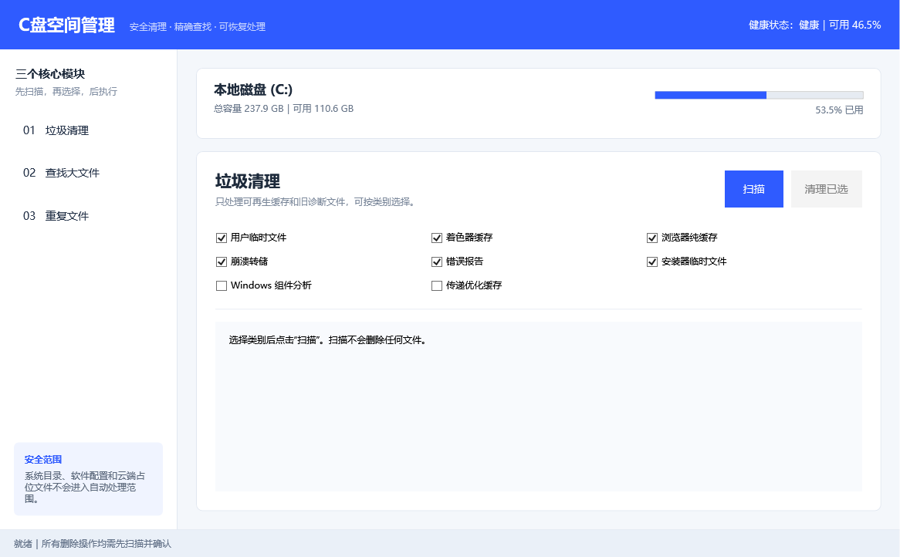

# Clean Windows C Drive Skill

A safety-first Agent Skill with a Simplified Chinese Windows interface for junk cleanup, large-file discovery, exact duplicate detection, C: health checks, and verified file handling.

中文说明见下方。

## Windows EXE

Download the standalone Windows x64 application from the [latest release](https://github.com/1181652815-hub/clean-windows-c-drive-skill/releases/latest). It runs without Codex or a separate .NET installation.

The application provides the same three Simplified Chinese modules as the Skill:

- Junk cleanup with a fixed regenerable-data allowlist.
- Large-file discovery in the current user's approved C: folders.
- Exact duplicate detection using file size and SHA-256.

The app starts without administrator rights. Windows component cleanup and Delivery Optimization require the user to deliberately run it as administrator; ordinary scanning and user-file review do not. The published executable is currently unsigned, so Windows may show an unknown-publisher warning. Verify the release SHA-256 before running it.

## What it does

- Runs a read-only health gate before cleanup.
- Checks free space, NTFS volume status, backing disk status, recent storage errors, and TRIM information.
- Audits Windows temporary data, update caches, crash dumps, and other cleanup candidates.
- Previews every supported cleanup before deletion.
- Provides a fixed deep-safe profile for user temp files, DirectX shader cache, Chrome/Edge cache-only directories, old crash dumps, Windows error reports, and installer temporary files.
- Uses DISM component cleanup and Delivery Optimization cleanup only through supported Windows commands and only after approval.
- Includes a blue-and-white three-module desktop interface: Junk Cleanup, Large Files, and Duplicate Files.
- Scans large and duplicate files only in the current user's approved C: folders.
- Confirms duplicates by matching size and SHA-256, keeps at least one copy, and sends approved files to the Recycle Bin.
- Builds an exact relocation manifest for approved large Downloads files.
- Relocates by copy, size/SHA-256 verification, then source deletion.
- Refuses arbitrary paths, destination overwrites, reparse points, offline placeholders, and protected system locations.

## Safety model

The skill never treats a general “clean C:” request as permission to delete unspecified data. It does not manually delete Windows, Program Files, ProgramData, WinSxS, DriverStore, recovery data, user documents, cloud roots, application profiles, game libraries, WSL, Docker, or virtual machines.

Installed apps and games must be moved through Windows Settings or the application's supported migration feature. The health result is a point-in-time assessment, not a guarantee against future hardware failure; keep independent backups.

## Repository layout

```text
app/
└── CDriveManager/             # .NET 8 WPF desktop application
skills/
└── clean-windows-c-drive/
    ├── SKILL.md
    ├── agents/openai.yaml
    ├── references/
    └── scripts/
```

## Install for Codex on Windows

```powershell
git clone https://github.com/1181652815-hub/clean-windows-c-drive-skill.git
$skillSource = Join-Path (Get-Location) 'clean-windows-c-drive-skill\skills\clean-windows-c-drive'
$skillDestination = Join-Path $env:USERPROFILE '.codex\skills\clean-windows-c-drive'
Copy-Item -LiteralPath $skillSource -Destination $skillDestination -Recurse -Force
```

Restart Codex if the skill does not appear immediately.

## Use

Open the Simplified Chinese desktop interface:

```powershell
powershell -NoProfile -STA -ExecutionPolicy Bypass -File "$env:USERPROFILE\.codex\skills\clean-windows-c-drive\scripts\Start-CDriveManager.ps1"
```



Read-only health and space audit:

```text
Use $clean-windows-c-drive to check my C: drive health and show safe cleanup candidates. Do not change anything.
```

Preview safe cleanup:

```text
Use $clean-windows-c-drive to preview low-risk cleanup. Do not delete anything until I approve exact categories.
```

Preview the fixed deep-safe profile:

```text
Use $clean-windows-c-drive to run a deep-safe cleanup preview, including Windows component-store analysis. Show everything first and do not delete until I approve.
```

Preview relocation to D::

```text
Use $clean-windows-c-drive to create a manifest of large old Downloads files that can be safely relocated to D:. Do not move anything yet.
```

## 中文介绍

这是一个带简体中文桌面界面的 Windows C 盘空间管理 Skill，包含“垃圾清理、查找大文件、重复文件”三个模块。启动后会先检查 C 盘状态，再进入扫描和处理流程。

核心原则：先检查、再预览、逐项确认、最后执行。它不会因为一句“清理 C 盘”就删除未指定内容。

### 直接下载 EXE

不使用 Codex 的用户可以在 [GitHub Releases](https://github.com/1181652815-hub/clean-windows-c-drive-skill/releases/latest) 下载 `CDriveManager.exe`。这是 Windows x64 单文件版本，不需要另外安装 .NET，双击即可打开。

程序默认以普通权限运行；只有 Windows 组件清理、传递优化等系统操作需要用户主动选择“以管理员身份运行”。普通扫描、大文件检查和重复文件检查不需要管理员权限。当前发布文件没有商业代码签名，如系统提示“未知发布者”，请先确认文件来自本仓库 Release，并核对 `SHA256SUMS.txt`。

### 可以做什么

- 自动检测 C 盘健康状态。
- 提供蓝白简体中文桌面界面，三个模块一页切换。
- 分析临时文件、更新缓存和崩溃转储等占用。
- 预览符合年龄规则的低风险清理文件。
- 使用固定“深度安全档”清理临时文件、着色器缓存、浏览器纯缓存、旧崩溃转储、错误报告和安装器临时文件。
- 组件存储和传递优化缓存只通过 Windows 官方命令处理。
- 查找当前用户 C 盘目录中的大文件，并按图片、视频、音频、文档、压缩包与安装包分类。
- 先比较大小、再用 SHA-256 确认重复文件；每组至少保留一份。
- 对明确勾选的普通用户文件重新校验后移至 Windows 回收站。
- 在明确批准后清理白名单目录。
- 为 Downloads 中较大、较旧的普通文件生成精确转存清单。
- 先复制到其他固定磁盘，校验大小和 SHA-256 后才删除 C 盘原件。

### 不会做什么

- 不手动删除 Windows、Program Files、ProgramData、WinSxS 或恢复数据。
- 不批量移动 AppData、软件目录、游戏库、云盘、WSL、Docker 或虚拟机。
- 不覆盖目标磁盘已有文件。
- 不在没有明确确认时执行删除或移动。
- 不把一次检测结果描述成永久健康保证。

### 中文调用示例

```text
使用 $clean-windows-c-drive 检查 C 盘健康并扫描可清理内容，先给我报告，不要删除或移动任何文件。
```

```text
使用 $clean-windows-c-drive 运行深度安全清理预览，包括组件存储分析；先列出全部候选，等我确认后再执行。
```

## Requirements

- Windows 10 or Windows 11
- Windows PowerShell 5.1 or PowerShell 7+
- For the Skill: an Agent Skills-compatible agent such as Codex
- For the standalone app: 64-bit Windows; Codex and a separate .NET installation are not required

## License

MIT
